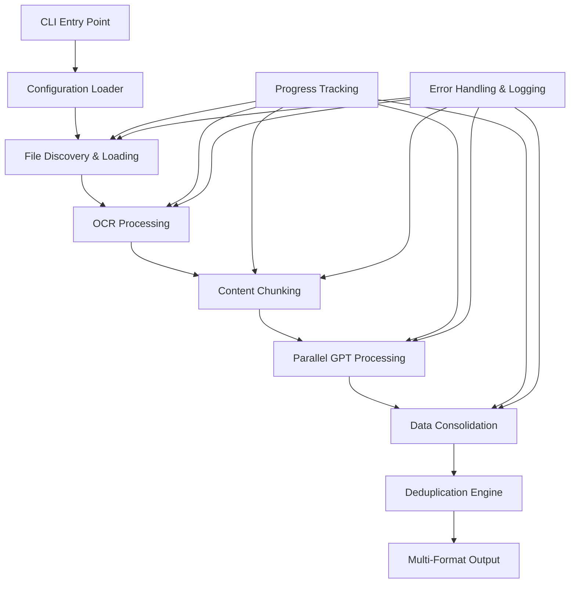

# Design Document

## Overview

The Document Organizer is architected as a modular Python CLI application that leverages Azure OpenAI GPT-4.1's 1M-token context window for intelligent document processing. The system follows a pipeline architecture with clear separation of concerns: file ingestion → OCR processing → content chunking → parallel GPT analysis → data consolidation → multi-format output generation.

The design prioritizes scalability through async processing, maintainability through modular components, and reliability through comprehensive error handling and data backup strategies.

## Architecture

### High-Level Architecture



### Processing Pipeline

1. **Initialization Phase**: Load configuration, validate Azure credentials, create output directories
2. **Discovery Phase**: Scan input directory, categorize files by type, estimate processing scope
3. **Ingestion Phase**: Load file contents, apply OCR where needed, extract raw text
4. **Preparation Phase**: Chunk content by token limits, prepare GPT prompts based on mode
5. **Analysis Phase**: Execute parallel GPT calls, collect structured responses
6. **Consolidation Phase**: Merge responses, apply deduplication rules, generate summaries
7. **Output Phase**: Export to multiple formats with full traceability

## Components and Interfaces

### Core Components

#### 1. CLI Interface (`organizer.py`)
- **Purpose**: Entry point and argument parsing
- **Key Methods**:
  - `main()`: Primary execution flow
  - `parse_arguments()`: CLI argument validation
  - `setup_logging()`: Configure logging system
- **Dependencies**: argparse, logging, asyncio

#### 2. Configuration Manager (`utils/config.py`)
- **Purpose**: Load and validate Azure OpenAI credentials
- **Key Methods**:
  - `load_config()`: Read config.json
  - `validate_azure_config()`: Test API connectivity
- **Configuration Schema**:
```json
{
  "azure_openai": {
    "endpoint": "https://your-resource.openai.azure.com/",
    "api_key": "your-api-key",
    "deployment_name": "gpt-4-1106-preview",
    "api_version": "2024-02-15-preview"
  },
  "processing": {
    "max_concurrent_requests": 10,
    "chunk_size_tokens": 8000,
    "retry_attempts": 3
  }
}
```

#### 3. File Loader (`utils/file_loader.py`)
- **Purpose**: Multi-format file content extraction
- **Key Methods**:
  - `load_text_file()`: Plain text extraction
  - `load_docx_file()`: Word document processing
  - `load_pdf_file()`: PDF text extraction with page tracking
  - `discover_files()`: Recursive file discovery with filtering
- **Supported Formats**: .txt, .docx, .pdf, .jpg, .png
- **Output**: Structured content with metadata (filename, page numbers, file type)

#### 4. OCR Engine (`utils/ocr.py`)
- **Purpose**: Extract text from images and scanned PDFs
- **Key Methods**:
  - `extract_from_image()`: Process image files
  - `extract_from_scanned_pdf()`: Handle scanned PDF pages
  - `detect_scanned_content()`: Identify documents requiring OCR
- **Dependencies**: pytesseract, Pillow, pdf2image
- **Error Handling**: Graceful degradation when OCR fails

#### 5. Content Chunker (`utils/chunker.py`)
- **Purpose**: Token-aware content segmentation
- **Key Methods**:
  - `chunk_by_tokens()`: Split content using tiktoken
  - `preserve_context()`: Maintain document boundaries
  - `calculate_tokens()`: Accurate token counting
- **Strategy**: Preserve document integrity while respecting token limits
- **Output**: Chunks with metadata linking back to source files

#### 6. Azure GPT Client (`utils/azure_gpt.py`)
- **Purpose**: Async Azure OpenAI API integration
- **Key Methods**:
  - `process_chunk_async()`: Single chunk processing
  - `batch_process()`: Parallel chunk processing with concurrency control
  - `generate_outline()`: Create document collection outline
- **Features**:
  - Async/await pattern for optimal performance
  - Retry logic with exponential backoff
  - Rate limiting and error handling
  - Response validation and parsing

#### 7. Data Processor (`utils/processor.py`)
- **Purpose**: Response consolidation and deduplication
- **Key Methods**:
  - `merge_medical_data()`: Medical-specific deduplication
  - `merge_life_data()`: Career-specific deduplication
  - `consolidate_responses()`: Combine all GPT outputs
- **Deduplication Rules**:
  - Medical: Merge conditions, preserve all visit dates
  - Life: Merge roles, preserve complete date ranges
- **Output**: Structured data ready for export

#### 8. Output Writer (`utils/output_writer.py`)
- **Purpose**: Multi-format export generation
- **Key Methods**:
  - `write_markdown()`: Generate MD summaries
  - `write_docx()`: Create Word documents
  - `write_csv()`: Export structured data
  - `backup_json()`: Save raw GPT responses
- **Features**: Template-based generation, source traceability

### Interface Contracts

#### File Content Structure
```python
@dataclass
class DocumentContent:
    filename: str
    content: str
    page_numbers: List[int]
    file_type: str
    ocr_applied: bool
    extraction_confidence: float
```

#### GPT Response Structure
```python
@dataclass
class GPTResponse:
    chunk_id: str
    structured_data: Dict[str, Any]
    summary: str
    confidence_score: float
    source_references: List[str]
    processing_time: float
```

## Data Models

### Medical Data Model
```python
@dataclass
class MedicalRecord:
    condition: str
    visit_dates: List[datetime]
    medications: List[str]
    physician: str
    notes: str
    source_files: List[str]
    page_references: List[int]
    confidence_score: float
```

### Life History Data Model
```python
@dataclass
class LifeHistoryRecord:
    role: str
    start_date: datetime
    end_date: Optional[datetime]
    location: str
    key_achievements: List[str]
    source_files: List[str]
    page_references: List[int]
    confidence_score: float
```

### Processing Metadata
```python
@dataclass
class ProcessingMetadata:
    total_files: int
    processed_files: int
    failed_files: List[str]
    total_tokens: int
    api_calls_made: int
    processing_time: float
    output_files_generated: List[str]
```

## Error Handling

### Error Categories and Strategies

1. **Configuration Errors**
   - Missing config.json: Provide template and clear instructions
   - Invalid Azure credentials: Test connectivity and provide diagnostic info
   - Missing dependencies: Clear installation instructions

2. **File Processing Errors**
   - Corrupted files: Log error, continue with other files
   - OCR failures: Fallback to filename-based processing
   - Unsupported formats: Skip with warning

3. **API Errors**
   - Rate limiting: Implement exponential backoff
   - Token limit exceeded: Automatic chunking
   - Network failures: Retry with circuit breaker pattern

4. **Output Errors**
   - Disk space issues: Check available space before writing
   - Permission errors: Clear error messages with solutions

### Error Recovery Mechanisms

- **Graceful Degradation**: Continue processing when individual files fail
- **Checkpoint System**: Save progress to allow resuming interrupted processing
- **Comprehensive Logging**: Detailed logs for troubleshooting
- **User Feedback**: Clear progress indicators and error reporting

## Testing Strategy

### Unit Testing Approach

1. **Component Testing**
   - File loader: Test each format with sample files
   - OCR engine: Test with various image qualities
   - Chunker: Verify token counting accuracy
   - GPT client: Mock API responses for testing
   - Processor: Test deduplication logic with known datasets

2. **Integration Testing**
   - End-to-end pipeline with sample document sets
   - Azure API integration with test credentials
   - Output format validation

3. **Performance Testing**
   - Large document set processing (1000+ files)
   - Concurrent API call optimization
   - Memory usage profiling

### Test Data Strategy

- **Medical Test Set**: Anonymized medical records with known duplicates
- **Life History Test Set**: Sample career documents with overlapping roles
- **OCR Test Set**: Various image qualities and document types
- **Edge Cases**: Corrupted files, empty documents, extremely large files

### Validation Criteria

- **Accuracy**: Structured data extraction matches manual review
- **Performance**: Processing 1000 pages within acceptable time limits
- **Reliability**: 99%+ success rate on well-formed documents
- **Traceability**: All output data traceable to source files

## Security and Privacy Considerations

### Data Protection
- **Local Processing**: All document content processed locally before API calls
- **API Security**: Secure Azure OpenAI credential management
- **Output Security**: Configurable output directory permissions

### Privacy Measures
- **No Data Retention**: GPT responses saved locally, not retained by Azure
- **Anonymization**: Support for PII redaction in test modes
- **Audit Trail**: Complete processing logs for compliance

## Performance Optimization

### Scalability Features
- **Async Processing**: Non-blocking I/O for file operations and API calls
- **Parallel Execution**: Configurable concurrency limits
- **Memory Management**: Streaming file processing for large documents
- **Caching**: Intelligent caching of OCR results and chunked content

### Resource Management
- **Token Budgeting**: Efficient token usage with smart chunking
- **Rate Limiting**: Respect Azure OpenAI API limits
- **Progress Tracking**: Real-time ETA calculations
- **Resource Monitoring**: Memory and CPU usage tracking